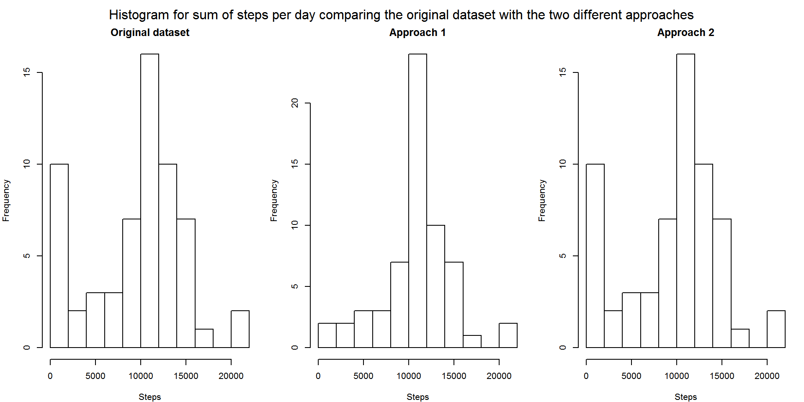

## Loading and preprocessing data

At first all packages needed for the analysis are loaded and a check whether the dataset is existing in this directory is necessary. If the directory does not contain the dataset it will be downloaded from the source. Be aware that in this case the working directory was not changed, i.e. the preset directory is used.

```{r}
library(data.table)
library(dplyr)
library(lubridate)

if(!(file.exists("activity.csv"))){
  file.url <- "https://d396qusza40orc.cloudfront.net/repdata%2Fdata%2Factivity.zip"
  download.file(file.url, destfile = "repdata_data_activity.zip", method = "curl")
  unzip("repdata_data_activity.zip", overwrite = TRUE)
}
```

The dataset can be read into R now since it exists now in our working directory. The settings header = TRUE and sep = "," are specific to this dataset. It can be opened it in a text editor to check the choice of settings before loading.

```{r, cache = TRUE}
dat <- read.csv("activity.csv", header = TRUE, sep = ",")
summary(dat)
str(dat)

steps.na <- sum(is.na(dat$steps))
```

Summary() and str() was used to get a first overview of the dataset. It can seen that the date is a factor and needs to be transformed into a date format. Another interesting thing which is directly obvious is that the steps column includes `r steps.na` NA values.  
Next step is to convert the original date and interval into a valid date format. Therefore the date column is converted into a date format with as.POSIXct() first. As next step the interval is transformed in a readable string of characters based on how many digits the original integer number has. As last the day and time columns are combined in the date column as POSIXct and a column is added for the weekday and the week.

```{r, cache = TRUE}
dat$day <- as.POSIXct(dat$date, tz = "UTC")

n <- dim(dat)[1]

for (i in 1:n){
  if (nchar(dat$interval[i]) == 1){
    dat$time[i] = paste("0", as.character(dat$interval[i]), sep = ":")
  }
  if (nchar(dat$interval[i]) == 2){
    dat$time[i] = paste("0", as.character(dat$interval[i]), sep = ":")
  }
  if (nchar(dat$interval[i]) == 3){
    dat$time[i] = paste(substr(dat$interval[i], 1, 1), substr(dat$interval[i], 2, 3), sep = ":")
  }
  if (nchar(dat$interval[i]) == 4){
    dat$time[i] = paste(substr(dat$interval[i], 1, 2), substr(dat$interval[i], 3, 4), sep = ":")
  }
}
dat$date <- as.POSIXct(paste(dat$day, dat$time), tz = "UTC", format = "%Y-%m-%d %H:%M")
dat$weekday <- weekdays(dat$date)

str(dat)
```

## Mean number of steps per day

The day column is used to group the days (group_by) and calculate the sum of steps per day (summarize & sum). Therefore the dplyr package was loaded and used. As last three histograms where printed using the subdividing via par(mfrow = c(1, 3)) and different breaks, 5, 10 and 20 respectively.

```{r figure1, fig.height = 6, fig.width = 10, cache = TRUE}
steps <- dat %>%
  select(steps, day) %>%
  group_by(day) %>%
  summarize(steps = sum(steps, na.rm = TRUE))

par(mfrow= c(1, 3), mar = c(4, 4, 2, 1), oma = c(0, 0, 2, 0))
hist(steps$steps, breaks = 5, xlab = "Steps", main = "5 breaks")
hist(steps$steps, breaks = 10, xlab = "Steps", main = "10 breaks")
hist(steps$steps, breaks = 20, xlab = "Steps", main = "20 breaks")
mtext("Histogram for sum of steps per day using 5, 10 and 20 breaks", outer = TRUE)
```
```{r, cache = TRUE}
mnsteps <- format(mean(steps$steps, na.rm = TRUE), digits = 4, scientific = FALSE)
mdsteps <- format(median(steps$steps, na.rm = TRUE), digits = 5, scientific = FALSE)
steps.day.null <- sum(steps$steps == 0, na.rm = TRUE)
```
 
The different number of breaks is used to visualize the occurrence of intervals on different scales. Overall 10 breaks would probably be the best choice but 20 breaks gives directly the inside that the interval between 10000 and 12000 steps is by far the most common next to the one with 0 to 2000 steps. The second interval (0 to 2000) occurs so often due to then heavily skewed data, i.e. due to missing values and the zero inflated dataset exist `r steps.day.null` days with zero steps. The difference of the mean (`r mnsteps`) and median (`r mdsteps`) is showing this effect clearly.

## Average daily activity pattern

The daily activity pattern is to be explored next. Therefore the mean, median and maximum of steps per day as well as the date of the maximum were calculated. The plot shows the number of steps in each five minute interval.  

```{r}
steps.mean <- mean(dat$steps, na.rm = TRUE)
steps.median <- (median(dat$steps, na.rm = TRUE))
steps.max <- max(dat$steps, na.rm = TRUE)
steps.max.date <- dat[which(dat$steps == steps.max), ]
steps.null <- sum(dat$steps == 0, na.rm = TRUE)
```
```{r figure2, fig.height = 6, fig.width = 10}
par(mfrow = c(1, 1), mar = c(4, 4, 2, 1))
with(dat,plot(steps~date, type = "l", ylim = c(0, 1000), xlab = "Date", ylab = "# of steps per 5 min interval", main = "Number of steps per 5 min interval between 01/10/2012 and 30/11/2012"))
abline(h = steps.mean, col = "red", lty = 3)
abline(h = steps.median, col = "blue", lty = 3)
abline(h = steps.max, col = "green", lty = 3)
legend("topright", lty = 3, bty = "n", cex = 1, col = c("red", "blue", "green"), legend = c("Mean", "Median", "Max"))
```
 
The graph shows clearly that there are days with missing data. Due to the heavily skewed data, i.e. `r steps.null` values are equal to zero. Therefore the median (blue dotted line) is `r steps.median` and the mean (red dotted line) is `r round(steps.mean, 0)`. The maximum of steps is `r steps.max` which occurred on `r steps.max.date$date`.

## Inputting missing values

Next step is to deal with the missing values. Therefore the number of missing values was calculated and two copies of the original dataset to visualize cahnges between the two different approaches and the original. One way is to replace the number of steps with the mean number of steps over all days for this five minute increment. The second way is to replace them with zeros.   

```{r, cache = TRUE}
steps.na <- sum(is.na(dat$steps))
dat.new1 <- dat
dat.new2 <- dat

steps.tod <- dat %>%
  select(steps, time) %>%
  group_by(time) %>%
  summarize(steps = round(mean(steps, na.rm = TRUE), 0))

for (i in 1:n){
  if (is.na(dat.new1$steps[i]) == TRUE){
    dat.new1$steps[i] <- steps.tod$steps[steps.tod$time == dat$time[i]]
    dat.new2$steps[i] <- 0
  }
}

steps1 <- dat.new1 %>%
  select(steps, day) %>%
  group_by(day) %>%
  summarize(steps = sum(steps, na.rm = TRUE))

steps2 <- dat.new2 %>%
  select(steps, day) %>%
  group_by(day) %>%
  summarize(steps = sum(steps, na.rm = TRUE))

mnsteps1 <- format(mean(steps1$steps, na.rm = TRUE), digits = 5, scientific = FALSE)
mdsteps1 <- format(median(steps1$steps, na.rm = TRUE), digits = 5, scientific = FALSE)
mnsteps2 <- format(mean(steps2$steps, na.rm = TRUE), digits = 4, scientific = FALSE)
mdsteps2 <- format(median(steps2$steps, na.rm = TRUE), digits = 5, scientific = FALSE)

overview <- data.frame(original = c(mnsteps, mdsteps, sum(dat$steps, na.rm = TRUE)), Approach1 = c(mnsteps1, mdsteps1, sum(dat.new1$steps)), Approach2 = c(mnsteps2, mdsteps2, sum(dat.new2$steps)), row.names = c("mean", "median", "total"))
print(overview)
```

Overall there are `r steps.na` missing values which were replaced in two different ways. The table shows that, as expected, the approach 2, replacement with 0, changes nothing since we are looking at total days. The same can be seen in the histogram. The mean, median and total number of steps over the two month  are all increased by replacing the missing values by averages as expected.

```{r figure3, cache = TRUE, fig.height = 6, fig.width = 10}
par(mfrow= c(1, 3), mar = c(4, 4, 2, 1), oma = c(0, 0, 2, 0))
hist(steps$steps, breaks = 10, xlab = "Steps", main = "Original dataset")
hist(steps1$steps, breaks = 10, xlab = "Steps", main = "Approach 1")
hist(steps2$steps, breaks = 10, xlab = "Steps", main = "Approach 2")
mtext("Histogram for sum of steps per day comparing the original dataset with the two different approaches", outer = TRUE)
```
 
```{r, cache = TRUE}
steps1.mean <- mean(dat.new1$steps, na.rm = TRUE)
steps1.median <- (median(dat.new1$steps, na.rm = TRUE))
steps1.max <- max(dat.new1$steps, na.rm = TRUE)
```

The really difference between the original and the modified dataset can be seen when the activity pattern is plotted over time. Some gaps, like the one at the start of the plot, show a spike in the modified dataset as expected. The mean number of steps stays roughly constant, `r round(steps.mean, 3)` and `r round(steps1.mean, 3)` respectively, as well as the median, `r steps.median` and `r steps1.median` respectively.  

```{r figure4, cache = TRUE, fig.height = 12, fig.width = 10}

par(mfrow = c(2, 1), mar = c(4, 4, 2, 1), oma = c(2, 0, 2, 0))
with(dat,plot(steps~date, type = "l", ylim = c(0, 1000), xlab = "", ylab = "# of steps per 5 min interval", main = "Original dataset", cex.main = .75))
abline(h = steps.mean, col = "red", lty = 3)
abline(h = steps.median, col = "blue", lty = 3)
abline(h = steps.max, col = "purple", lty = 3)
abline(v = c(day.na$day[day.na$date.na == TRUE], lty = 3, day.na$day[day.na$date.na == TRUE] + days(1)), col = "green")
with(dat.new1,plot(steps~date, type = "l", ylim = c(0, 1000), xlab = "Date", ylab = "# of steps per 5 min interval", main = "Modified dataset", cex.main = .75))
abline(h = steps1.mean, col = "red", lty = 3)
abline(h = steps1.median, col = "blue", lty = 3)
abline(h = steps1.max, col = "purple", lty = 3)
abline(v = c(day.na$day[day.na$date.na == TRUE], lty = 3, day.na$day[day.na$date.na == TRUE] + days(1)), col = "green")
mtext("Number of steps per 5 min interval between 01/10/2012 and 30/11/2012", outer = TRUE)
par(fig = c(0, 1, 0, 1), oma = c(0, 0, 0, 0), mar = c(0, 0, 0, 0), new = TRUE)
plot(0, 0, type = "n", bty = "n", xaxt = "n", yaxt = "n")
legend("bottomright", c("Mean", "Median", "Max", "Days conatining NA's"), xpd = TRUE, horiz = TRUE, inset = c(0, 0), bty = "n", lty = c(3, 3, 3, 1), col = c("red", "blue", "purple", "green"), cex = 1)
```
 
## Difference in the activity between weekdays and weekends

An additional column was added to the original dataset and approach one containing a factor variable dividing the days in weekdays and weekend. The graph shows both datasets, the original and modified one, and highlights weekdays and weekends.   

```{r, cache = TRUE}
for (i in 1:n){
  if (dat$weekday[i] == "Sunnday" | dat$weekday[i] == "Saturday"){
    dat$tow[i] <- "weekend"
    dat.new1$tow[i] <- "weekend"
  }else{
    dat$tow[i] <- "weekday"
    dat.new1$tow[i] <- "weekday"
  }
}
```

```{r figure5, cache = TRUE, fig.height = 12, fig.width = 10}
lim.date <- c(as.POSIXct("2012-09-30"), as.POSIXct("2012-12-01"))
par(mfrow = c(2, 1), mar = c(4, 4, 2, 1), oma = c(2, 0, 2, 0))
with(dat,plot(steps[tow == "weekend"]~date[tow == "weekend"],
              type = "l", ylim = c(0, 1000), xlim = lim.date, xlab = "Date",
              ylab = "# of steps per 5 min interval", main = "Original dataset", cex.main = .75))
with(dat, lines(steps[tow == "weekday"]~date[tow == "weekday"], col = "red"))
abline(v = c(day.na$day[day.na$date.na == TRUE], lty = 3, day.na$day[day.na$date.na == TRUE] + days(1)), col = "green")
with(dat.new1,plot(steps[tow == "weekend"]~date[tow == "weekend"],
              type = "l", ylim = c(0, 1000), xlim = lim.date, xlab = "Date", col = "black",
              ylab = "# of steps per 5 min interval", main = "Modified dataset", cex.main = .75))
with(dat.new1, lines(steps[tow == "weekday"]~date[tow == "weekday"], col = "red"))
abline(v = c(day.na$day[day.na$date.na == TRUE], lty = 3, day.na$day[day.na$date.na == TRUE] + days(1)), col = "green")
mtext("Number of steps per 5 min interval between 01/10/2012 and 30/11/2012 \n Difference between original and modified dataset", outer = TRUE)
par(fig = c(0, 1, 0, 1), oma = c(0, 0, 0, 0), mar = c(0, 0, 0, 0), new = TRUE)
plot(0, 0, type = "n", bty = "n", xaxt = "n", yaxt = "n")
legend("bottomright", c("Weekend", "Weekday"), xpd = TRUE, horiz = TRUE, inset = c(0, 0), bty = "n", lty = 1, col = c("black", "red"), cex = 1)
```
 
```{r, cache = TRUE}
steps.weekday1 <- dat %>%
  select(steps, tow) %>%
  group_by(tow) %>%
  summarize(steps = mean(steps, na.rm = TRUE))

steps.weekday2 <- dat.new1 %>%
  select(steps, tow) %>%
  group_by(tow) %>%
  summarize(steps = mean(steps, na.rm = TRUE))

print(merge(steps.weekday1, steps.weekday2, by = "tow") %>%
        mutate(PartofWeek = tow, MeanStepsOriginal = round(steps.x, 1),
               MeanStepsModified = round(steps.y, 1)) %>%
        select(PartofWeek, MeanStepsOriginal , MeanStepsModified))
```

The average number of steps does not change to much between the original dataset  and the modified one, but the number of steps at the weekend is much higher then during the week.